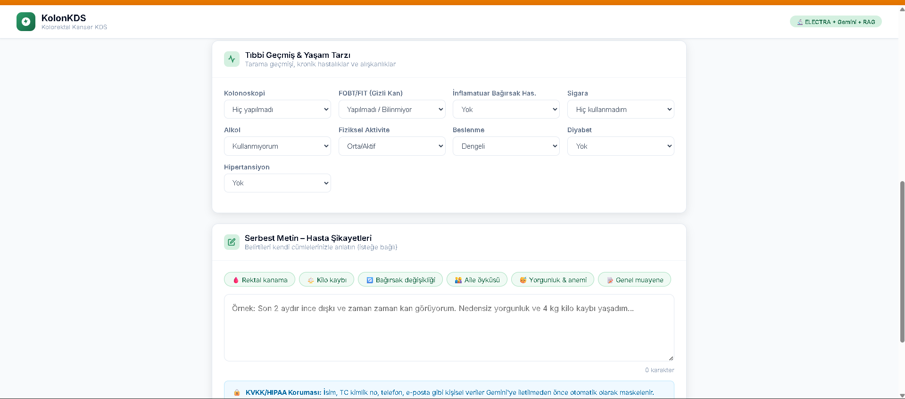
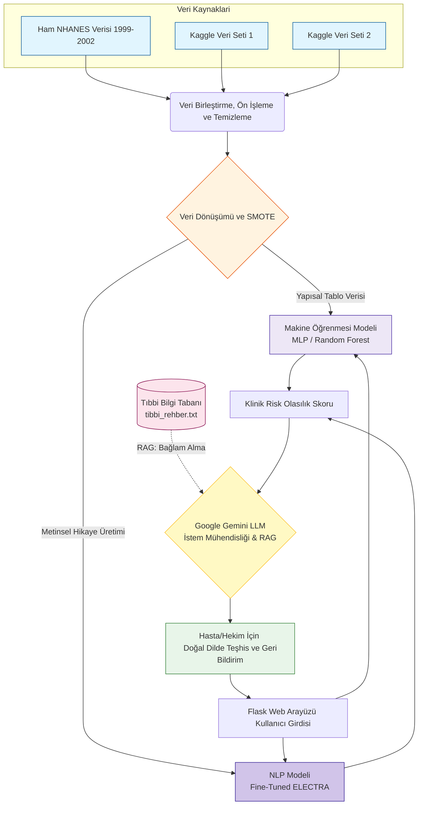
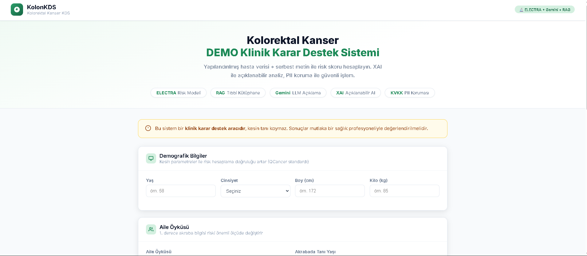
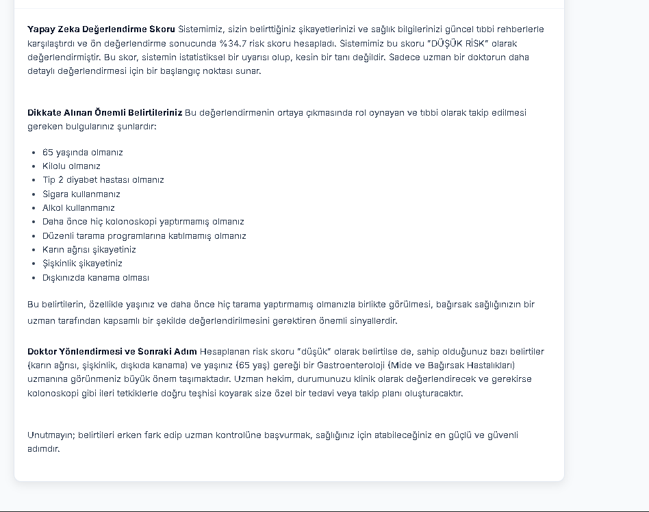

<div align="center">
  
  
  # Kolorektal Klinik Karar Destek Sistemi (KDS)
  
  **Makine Öğrenmesi, RAG Mimarisi ve Doğal Dil İşleme Destekli Gelişmiş Teşhis Platformu**
  
  [](https://huggingface.co/spaces/emirdfg/kolorektal-kds)
  [](https://www.python.org/)
  [](https://flask.palletsprojects.com/)
  [](https://deepmind.google/technologies/gemini/)
  
  [Canlı Uygulamaya Erişmek İçin Tıklayın (Hugging Face Spaces)](https://huggingface.co/spaces/emirdfg/kolorektal-kds)
</div>

---

## 1. Proje Özeti

**Kolorektal Klinik Karar Destek Sistemi (KDS)**, tıp profesyonellerine ve hastalara kolorektal kanser riskini değerlendirmelerinde yardımcı olmak amacıyla tasarlanmış gelişmiş bir analitik platformdur. Sistem, modelin genellenebilirliğini ve klinik doğruluğunu artırmak amacıyla **NHANES** (1999-2002) geçmiş sağlık anketi verileri ile **Kaggle'dan elde edilen iki farklı bağımsız medikal veri setinin** birleşiminden yararlanmaktadır.

Bu projenin temel yeniliği, çift modelli (dual-model) öngörü mekanizmasına ve **Retrieval-Augmented Generation (RAG)** mimarisine dayanmasında yatmaktadır. Sistem, yapısal klinik parametrelere dayalı ampirik risk skorlaması için geleneksel makine öğrenmesi algoritmalarını kullanırken, aynı anda yapılandırılmamış tıbbi anlatıları işlemek için alana özel olarak ince ayarı yapılmış (fine-tuned) **ELECTRA** transformer modelini kullanır. 

Nihai teşhis aşamasında ise sistem, RAG mimarisi ile `tibbi_rehber.txt` dosyasındaki medikal bağlamı (context) dinamik olarak alarak **Google Gemini LLM** modeline besler. Böylece Gemini, hem ELECTRA'nın metinsel analizini, hem MLP'nin matematiksel olasılık skorunu, hem de harici tıbbi bilgi tabanını kullanarak son kullanıcı için son derece doğru, halüsinasyondan arındırılmış ve kolay anlaşılır klinik geri bildirim raporları üretir.

---

## 2. Sistem Mimarisi ve Akış Diyagramı

Sistemin veri alımından, ELECTRA modeli analizine, RAG destekli bağlam zenginleştirmesine ve nihai klinik geri bildirime kadar olan operasyonel iş akışı (workflow) aşağıda detaylandırılmıştır.



---

## 3. Temel Teknik Özellikler

- **Gelişmiş ELECTRA Transformer Modeli:** Projenin bel kemiğini, hastaların anket yanıtlarından oluşturulan doğal dil hikayelerini analiz etmek için eğitilmiş ELECTRA mimarisi oluşturur. ELECTRA, geleneksel BERT modellerine kıyasla medikal terimlerin ardındaki nüansları ve risk faktörlerini tespit etmede daha yüksek verimlilik sunar.
- **RAG Mimari Entegrasyonu (Retrieval-Augmented Generation):** Gemini LLM, raporları üretirken sadece olasılık skorlarına (prompt) dayanmaz; aynı zamanda sisteme entegre edilen tıbbi rehber dokümanlarından (`tibbi_rehber.txt`) anlık olarak beslenerek halüsinasyon riskini minimize eder ve tıbbi doğruluğu en üst düzeye çıkarır.
- **Çoklu Veri Seti Harmonizasyonu:** Sadece NHANES verilerine bağlı kalınmamış, Kaggle platformundan alınan iki ek medikal veri seti sisteme entegre edilerek demografik çeşitlilik ve model doğruluğu global ölçeğe taşınmıştır.
- **Ampirik Risk Sınıflandırması:** Demografik vektörleri, laboratuvar sonuçlarını ve bildirilen semptomları işlemek için Çok Katmanlı Algılayıcılar (MLP) ve Rastgele Orman (Random Forest) kullanarak kolorektal malignite için kalibre edilmiş yapısal bir olasılık skoru oluşturur.
- **Kapsamlı Veri Mühendisliği:** Sentetik Azınlık Aşırı Örnekleme Teknikleri (SMOTE) kullanılarak ciddi sınıf dengesizliklerinin (class imbalance) giderilmesi dahil olmak üzere titiz veri ön işleme aşamalarını uygular.

---

## 4. Sistem Arayüzüne Genel Bakış

Aşağıdaki görseller, veri girişinden nihai teşhis çıktısına ve RAG destekli LLM raporuna kadar web uygulamasının operasyonel akışını göstermektedir.

| Klinik Veri Giriş Arayüzü | Teşhis Çıktısı ve LLM Analizi |
|:---:|:---:|
|  |  |
| *Kullanıcıların demografik ve semptomatolojik verilerini gönderdiği arayüz.* | *Elde edilen risk olasılığı ve RAG destekli Gemini açıklaması.* |

*Ek mimari ve arayüz görselleri `assets/` dizininde bulunabilir.*

---

## 5. Depo Mimarisi ve Dizin Yapısı (Directory Structure)

Proje deposu, veri işleme, model eğitimi ve dağıtım mantığının izole ve modüler kalmasını sağlayarak sorumlulukların kesin bir şekilde ayrılmasını (separation of concerns) koruyacak şekilde yapılandırılmıştır.

```text
kolorektal-kds/
├── assets/                  # Dokümantasyon için ekran görüntüleri ve medyalar
├── data/                    # NHANES ve Kaggle veri setleri ile ön işleme çıktıları
│   ├── raw_predata/         # Ham SAS (.xpt) formatlı dosyalar ve ham CSV'ler
│   ├── processed/           # Ara temizleme aşamasındaki CSV dosyaları
│   ├── last_final/          # SMOTE uygulanmış, eğitim öncesi ara veriler
│   ├── final/               # NLP ve ML modelleri için nihai hazır veri seti
│   └── tibbi_rehber.txt     # RAG mimarisi (Gemini LLM) için tıbbi bağlam referans belgesi
├── KDS_Deploy/              # Üretim (Production) ve Hugging Face dağıtım ortamı
│   ├── Kanser_Riski_Modeli_Temiz/ # Canlıya alınmış ince ayarlı ELECTRA modeli
│   ├── static/              # CSS ve istemci tarafı JavaScript dosyaları
│   ├── templates/           # Flask HTML şablonları
│   ├── app.py               # Ana Flask sunucusu ve Gemini API entegrasyonu
│   ├── Dockerfile           # Konteynerizasyon yapılandırması
│   └── requirements.txt     # Python bağımlılıkları
├── models/                  # Eğitilmiş modeller ve ağırlıklar (Serileştirilmiş .pkl)
├── notebooks/               # EDA, özellik mühendisliği ve model eğitim defterleri
├── scripts/                 # Veri artırma ve veri işleme otomasyon betikleri
├── web_app/                 # Prototip ve yerel UI denemeleri (Eski sürümler)
└── README.md                # Ana proje dokümantasyonu
```

*Her bir modülün iç işleyişine ilişkin son derece ayrıntılı bilgi için lütfen ilgili alt dizinde bulunan özel `README.md` dosyalarına başvurun.*

---

## 6. Veri Seti Metodolojisi (NHANES ve Kaggle)

Bu sistemin öngörücü temeli, modelin bölgesel veya dönemsel sapmalara (bias) uğramasını engellemek adına üç farklı kaynaktan beslenmektedir:
1. **National Health and Nutrition Examination Survey (NHANES):** Özellikle 1999-2000 ve 2001-2002 kohortlarını kapsayan geniş çaplı Amerikan anket verileri.
2. **Kaggle Veri Seti 1:** Kolorektal kanser semptomatolojisi üzerine bağımsız demografik kayıtlar.
3. **Kaggle Veri Seti 2:** Klinik test sonuçları ve erken teşhis göstergelerini içeren ek bir tıbbi veri seti.

Genel nüfus anketlerinde kolorektal kanser teşhislerinin doğası gereği nadir olması nedeniyle, veri setleri birleştirildiğinde derin bir sınıf dengesizliği sergilemekteydi. Bunu düzeltmek ve modelin çoğunluk sınıfına aşırı uyum sağlamasını (overfitting) önlemek için gelişmiş istatistiksel yeniden örnekleme ve veri artırma (SMOTE) betikleri geliştirildi. Ayrıca, son teknoloji NLP modellerinin (ELECTRA) eğitimini kolaylaştırmak için yapısal veriler programatik olarak sürekli metin formatlarına eşlendi.

---

## 7. Yerel Kurulum ve Dağıtım Rehberi

Ortamı kopyalamak ve uygulamayı yerel bir makinede çalıştırmak için lütfen aşağıdaki prosedürel adımları izleyin:

### Adım 1: Depoyu Klonlayın
Proje deposunu Git aracılığıyla yerel dosya sisteminize klonlayın.
```bash
git clone https://github.com/KULLANICI_ADINIZ/kolorektal-kds.git
cd kolorektal-kds
```

### Adım 2: Sanal Ortam (Virtual Environment) Oluşturun
Sistem geneli paketlerle çakışmaları önlemek için proje bağımlılıklarını bir Python sanal ortamı kullanarak izole etmeniz kesinlikle önerilir.
```bash
python -m venv .venv

# Windows mimarilerinde aktivasyon:
.venv\Scripts\activate

# UNIX/Linux/macOS mimarilerinde aktivasyon:
source .venv/bin/activate
```

### Adım 3: Bağımlılıkları Yükleyin
Dağıtım dizinine gidin ve manifestoda tanımlanan gerekli Python paketlerini yükleyin.
```bash
cd KDS_Deploy
pip install -r requirements.txt
```

### Adım 4: Ortam Değişkenlerini (Environment Variables) Yapılandırın
Uygulamanın Google Gemini LLM ile iletişim kurabilmesi için geçerli bir API anahtarına ihtiyacı vardır. Dağıtım dizininin kökünde bir `.env` dosyası oluşturun ve anahtarı tanımlayın.
```env
GEMINI_API_KEY=gercek_api_anahtarinizi_buraya_yazin
```

### Adım 5: Sunucuyu Başlatın
Flask uygulama sunucusunu başlatın.
```bash
python app.py
```
*Başarılı bir başlatmanın ardından, uygulama arayüzüne standart web tarayıcıları üzerinden `http://localhost:5000` adresinden erişilebilecektir.*

---

## 8. Geliştirme ve Katkıda Bulunma

Bu proje, geleneksel öngörücü modellemenin, RAG mimarisinin ve Büyük Dil Modellerinin (LLM'ler) entegre edilmesinin klinik teşhis desteği üzerinde yaratabileceği derin etkiyi göstermek amacıyla geliştirilmiştir. Mimari, daha fazla tıbbi veri setinin veya alternatif transformer modellerinin entegrasyonuna izin verecek şekilde genişletilebilir (extensible) olarak tasarlanmıştır.

Algoritmik optimizasyonlar, kullanıcı arayüzü geliştirmeleri veya veri mühendisliği iyileştirmeleri dahil olmak üzere kod tabanına yapılacak katkılar teşvik edilmektedir. Lütfen önerilen tüm değişiklikleri Çekme İstekleri (Pull Requests) aracılığıyla gönderin ve herhangi bir anomaliyi deponun Sorun izleyicisi (Issue tracker) aracılığıyla bildirin.
