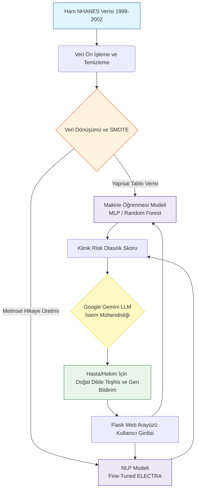

<div align="center">
  
  
  # Kolorektal Klinik Karar Destek Sistemi (KDS)
  
  **Makine Öğrenmesi ve Doğal Dil İşleme Destekli Gelişmiş Teşhis Platformu**
  
  [](https://huggingface.co/spaces/emirdfg/kolorektal-kds)
  [](https://www.python.org/)
  [](https://flask.palletsprojects.com/)
  [](https://deepmind.google/technologies/gemini/)
  
  [Canlı Uygulamaya Erişmek İçin Tıklayın (Hugging Face Spaces)](https://huggingface.co/spaces/emirdfg/kolorektal-kds)
</div>

---

## 1. Proje Özeti

**Kolorektal Klinik Karar Destek Sistemi (KDS)**, tıp profesyonellerine ve hastalara kolorektal kanser riskini değerlendirmelerinde yardımcı olmak amacıyla tasarlanmış gelişmiş bir analitik platformdur. 1999-2002 yılları arasındaki National Health and Nutrition Examination Survey (NHANES) geçmiş sağlık anketi verilerinden yararlanan bu sistem, yüksek oranda özelleştirilmiş Makine Öğrenmesi (Machine Learning) ve Doğal Dil İşleme (NLP) modelleri eğitmek için titiz veri mühendisliği metodolojileri uygulamaktadır.

Bu projenin temel yeniliği, çift modelli (dual-model) mimarisinde yatmaktadır: Yapısal klinik parametrelere dayalı ampirik risk skorlaması için geleneksel makine öğrenmesi algoritmalarını kullanırken, aynı anda yapılandırılmamış tıbbi anlatıları işlemek için ince ayarı yapılmış (fine-tuned) bir **ELECTRA** transformer modeli kullanır. Ayrıca sistem, öngörücü modellerin matematiksel çıktılarını yorumlayan ve bunları son kullanıcı için kapsamlı, kolay anlaşılır klinik geri bildirim raporlarına dönüştüren Google'ın **Gemini LLM** modeli ile derinlemesine entegre edilmiştir.

---

## 2. Sistem Mimarisi ve Akış Diyagramı

Sistemin veri alımından nihai klinik geri bildirime kadar olan operasyonel iş akışı (workflow) aşağıdaki mimari diyagramda detaylandırılmıştır.



---

## 3. Temel Teknik Özellikler

- **Ampirik Risk Sınıflandırması:** Demografik vektörleri, laboratuvar sonuçlarını ve bildirilen semptomları işlemek için Çok Katmanlı Algılayıcılar (MLP) ve Rastgele Orman (Random Forest) gibi sağlam makine öğrenmesi algoritmalarını kullanarak kolorektal malignite için kalibre edilmiş bir olasılık skoru oluşturur.
- **Üretken Yapay Zeka Entegrasyonu (Gemini LLM):** Karmaşık istatistiksel çıktılar ile hasta kavrayışı arasındaki boşluğu doldurur. Gemini modeli, risk skorlarının nüanslı, empatik ve tıbbi açıdan doğru açıklamalarını üretmek üzere bağlamsal olarak yönlendirilir.
- **Gelişmiş NLP Boru Hatları (Pipelines):** Klinik teşhis alanına özel olarak yoğun bir şekilde ince ayarı yapılmış bir ELECTRA modeline sahiptir. Veri işleme hattı, transformer'ın bağlam tutma kapasitesini artırmak için tablo şeklindeki ilişkisel verileri tutarlı "hasta hikayelerine" dönüştürür.
- **Kapsamlı Veri Mühendisliği:** Eksik değişkenlerin işlenmesi, özellik çıkarımı (feature extraction) ve en önemlisi, modelin adil ve doğru çalışmasını sağlamak için Sentetik Azınlık Aşırı Örnekleme Teknikleri (SMOTE) kullanılarak ciddi sınıf dengesizliklerinin (class imbalance) giderilmesi dahil olmak üzere titiz veri ön işleme aşamalarını uygular.
- **Üretime Hazır Web Mimarisi:** Uygulama, Docker aracılığıyla konteynerize edilmiş olup, yüksek erişilebilirlik, ölçeklenebilir çıkarım (inference) ve duyarlı bir kullanıcı arayüzü sağlamak amacıyla Flask arka ucu kullanılarak Hugging Face Spaces üzerinde dağıtılmıştır.

---

## 4. Sistem Arayüzüne Genel Bakış

Aşağıdaki görseller, veri girişinden nihai teşhis çıktısına ve LLM tarafından oluşturulan rapora kadar web uygulamasının operasyonel akışını göstermektedir.

| Klinik Veri Giriş Arayüzü | Teşhis Çıktısı ve LLM Analizi |
|:---:|:---:|
|  |  |
| *Kullanıcıların demografik ve semptomatolojik verilerini gönderdiği arayüz.* | *Elde edilen risk olasılığı ve Gemini tarafından oluşturulan detaylı açıklama.* |

*Ek mimari ve arayüz görselleri `assets/` dizininde bulunabilir.*

---

## 5. Depo Mimarisi ve Dizin Yapısı (Directory Structure)

Proje deposu, veri işleme, model eğitimi ve dağıtım mantığının izole ve modüler kalmasını sağlayarak sorumlulukların kesin bir şekilde ayrılmasını (separation of concerns) koruyacak şekilde yapılandırılmıştır.

```text
kolorektal-kds/
├── assets/                  # Dokümantasyon için ekran görüntüleri ve medyalar
├── data/                    # NHANES veri setleri ve ön işleme çıktıları
│   ├── raw_predata/         # Ham SAS (.xpt) formatlı dosyalar
│   ├── processed/           # Ara temizleme aşamasındaki CSV dosyaları
│   ├── last_final/          # SMOTE uygulanmış, eğitim öncesi ara veriler
│   ├── final/               # NLP ve ML modelleri için nihai hazır veri seti
│   └── tibbi_rehber.txt     # Gemini LLM için tıbbi bağlam referans belgesi
├── KDS_Deploy/              # Üretim (Production) ve Hugging Face dağıtım ortamı
│   ├── Kanser_Riski_Modeli_Temiz/ # Canlıya alınmış ince ayarlı ELECTRA modeli
│   ├── static/              # CSS ve istemci tarafı JavaScript dosyaları
│   ├── templates/           # Flask HTML şablonları
│   ├── app.py               # Ana Flask sunucusu ve Gemini API entegrasyonu
│   ├── Dockerfile           # Konteynerizasyon yapılandırması
│   └── requirements.txt     # Python bağımlılıkları
├── models/                  # Eğitilmiş modeller ve ağırlıklar (Serileştirilmiş .pkl)
├── notebooks/               # EDA, özellik mühendisliği ve model eğitim defterleri
├── scripts/                 # Veri artırma ve veri işleme otomasyon betikleri
├── web_app/                 # Prototip ve yerel UI denemeleri (Eski sürümler)
└── README.md                # Ana proje dokümantasyonu
```

*Her bir modülün iç işleyişine ilişkin son derece ayrıntılı bilgi için lütfen ilgili alt dizinde bulunan özel `README.md` dosyalarına başvurun.*

---

## 6. Veri Seti Metodolojisi (NHANES)

Bu sistemin öngörücü temeli, **National Health and Nutrition Examination Survey (NHANES)** veri setleri üzerine, özellikle 1999-2000 ve 2001-2002 kohortları hedeflenerek inşa edilmiştir.

Genel nüfus anketlerinde kolorektal kanser teşhislerinin doğası gereği nadir olması nedeniyle, veri seti başlangıçta derin bir sınıf dengesizliği (örneğin, minimum sayıda pozitif vakaya karşılık binlerce negatif vaka) sergilemekteydi. Bunu düzeltmek ve modelin çoğunluk sınıfına aşırı uyum sağlamasını (overfitting) önlemek için gelişmiş istatistiksel yeniden örnekleme ve veri artırma betikleri geliştirildi. Ayrıca, son teknoloji NLP modellerinin eğitimini kolaylaştırmak için yapısal anket yanıtları programatik olarak sürekli metin formatlarına eşlendi. Seçilen değişkenler ve artırma matematiği ile ilgili kapsamlı detaylar `data/` ve `scripts/` dokümantasyonlarında bulunabilir.

---

## 7. Yerel Kurulum ve Dağıtım Rehberi

Ortamı kopyalamak ve uygulamayı yerel bir makinede çalıştırmak için lütfen aşağıdaki prosedürel adımları izleyin:

### Adım 1: Depoyu Klonlayın
Proje deposunu Git aracılığıyla yerel dosya sisteminize klonlayın.
```bash
git clone https://github.com/KULLANICI_ADINIZ/kolorektal-kds.git
cd kolorektal-kds
```

### Adım 2: Sanal Ortam (Virtual Environment) Oluşturun
Sistem geneli paketlerle çakışmaları önlemek için proje bağımlılıklarını bir Python sanal ortamı kullanarak izole etmeniz kesinlikle önerilir.
```bash
python -m venv .venv

# Windows mimarilerinde aktivasyon:
.venv\Scripts\activate

# UNIX/Linux/macOS mimarilerinde aktivasyon:
source .venv/bin/activate
```

### Adım 3: Bağımlılıkları Yükleyin
Dağıtım dizinine gidin ve manifestoda tanımlanan gerekli Python paketlerini yükleyin.
```bash
cd KDS_Deploy
pip install -r requirements.txt
```

### Adım 4: Ortam Değişkenlerini (Environment Variables) Yapılandırın
Uygulamanın Google Gemini LLM ile iletişim kurabilmesi için geçerli bir API anahtarına ihtiyacı vardır. Dağıtım dizininin kökünde bir `.env` dosyası oluşturun ve anahtarı tanımlayın.
```env
GEMINI_API_KEY=gercek_api_anahtarinizi_buraya_yazin
```

### Adım 5: Sunucuyu Başlatın
Flask uygulama sunucusunu başlatın.
```bash
python app.py
```
*Başarılı bir başlatmanın ardından, uygulama arayüzüne standart web tarayıcıları üzerinden `http://localhost:5000` adresinden erişilebilecektir.*

---

## 8. Geliştirme ve Katkıda Bulunma

Bu proje, geleneksel öngörücü modellemenin Büyük Dil Modelleri (LLM'ler) ile entegre edilmesinin klinik teşhis desteği üzerinde yaratabileceği derin etkiyi göstermek amacıyla geliştirilmiştir. Mimari, daha fazla tıbbi veri setinin veya alternatif transformer modellerinin entegrasyonuna izin verecek şekilde genişletilebilir (extensible) olarak tasarlanmıştır.

Algoritmik optimizasyonlar, kullanıcı arayüzü geliştirmeleri veya veri mühendisliği iyileştirmeleri dahil olmak üzere kod tabanına yapılacak katkılar teşvik edilmektedir. Lütfen önerilen tüm değişiklikleri Çekme İstekleri (Pull Requests) aracılığıyla gönderin ve herhangi bir anomaliyi deponun Sorun izleyicisi (Issue tracker) aracılığıyla bildirin.
